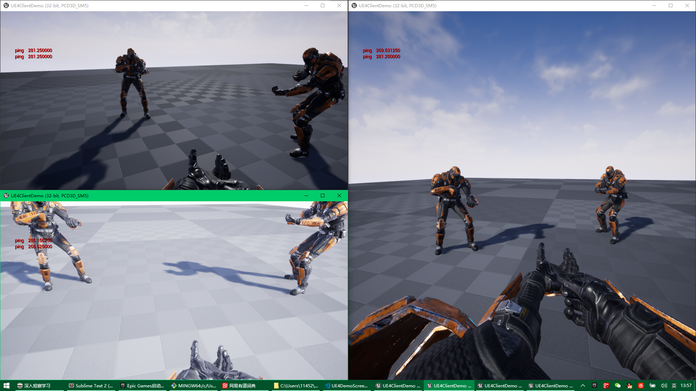

# A Realtime Dedicated Game Server

一个实时的专用游戏服务器

<!-- 

# Download & Play
 
 
- Client : [UE4ClientDemo.exe (Win32)](https://pan.baidu.com/s/1B0pMYls7JVYqEWyKH4gkXg) , just check it out !

- 客户端 : 下载 [UE4ClientDemo.exe (Win32)](https://pan.baidu.com/s/1B0pMYls7JVYqEWyKH4gkXg) 玩一下 !

- Server : A server instance is running on my VPS, so just double click the UE4ClientDemo.exe that will connect to my server automatically, enjoy !

- 服务器 : 我VPS上运行着一个服务器实例, 你只需要双击 UE4ClientDemo.exe , 它就会自动连到服务器啦 

! -->

# About This 

- A [UE4 State Synchronization demo](https://github.com/no5ix/realtime-server-ue4-demo) for it
- 附一个[虚幻4状态同步Demo](https://github.com/no5ix/realtime-server-ue4-demo)
    - Video Preview 视频演示 : [Click me 点我](https://hulinhong.com)
    - 
    - No Replication component from UE4, just socket
    - 没有用UE4的网络同步组件, 唯socket而已
    -
    - Unreal Engine Version : 4.16 - 4.19
    - 虚幻引擎版本 : 兼容 4.16 - 4.19
    -
    - A realtime-server example for this ue4 demo.(see [this](https://github.com/no5ix/realtime-server/tree/master/example/for_ue4_demo))
    - 为这个ue4的demo写了一个realtime-server的例子.(看 [这个](https://github.com/no5ix/realtime-server/tree/master/example/for_ue4_demo))
- Win/Linux
- Multi-Thread
- RUDP
- C++11
- Bit Stream
- Add UDP support for muduo

# Usage

- Windows : 
    1. open ` ms_vs2015/realtime_srv.sln `
    2. compile `realtime_srv`
    3. compile `example_for_ue4_demo`. 
    4. run `example_for_ue4_demo`
- Linux : 
    1. cd tool/
    2. sh build_rs.sh -j2
    3. ./run_rs.sh ( ` ./run_rs.sh 1 ` for daemonize )