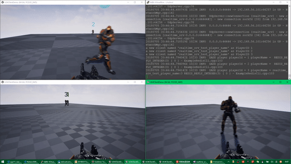

# A Realtime Dedicated Game Server

一个实时的专用游戏服务器

<!--  -->

<!-- 

# Download & Play
 
 
- Client : [UE4ClientDemo.exe (Win32)](https://pan.baidu.com/s/1B0pMYls7JVYqEWyKH4gkXg) , just check it out !

- 客户端 : 下载 [UE4ClientDemo.exe (Win32)](https://pan.baidu.com/s/1B0pMYls7JVYqEWyKH4gkXg) 玩一下 !

- Server : A server instance is running on my VPS, so just double click the UE4ClientDemo.exe that will connect to my server automatically, enjoy !

- 服务器 : 我VPS上运行着一个服务器实例, 你只需要双击 UE4ClientDemo.exe , 它就会自动连到服务器啦 

! -->

# About This 

- master branch (focus on Linux) 
-  [win_version](https://github.com/no5ix/realtime-server/tree/win_version) branch (Linux & Win both)
- Bit Stream
- Powered by my another project [kcpp](https://github.com/no5ix/kcpp) (A kcp session single-header-only implementation, dynamic redundancy + reliable udp/unreliable channel)
- Multi-Thread
- RUDP
- C++11

# Example

- Server side 服务端 : [realtime-server example](https://github.com/no5ix/realtime-server/tree/master/example/for_ue4_demo)
- Client side 客户端 : [UE4 demo](https://github.com/no5ix/realtime-server-ue4-demo) (done) | Unity demo (ing...)
- [Video Preview 视频演示](https://hulinhong.com)

# QQ群

觉得好的话, star一哈项目并加群 496687140 吧, 群里可以得到我的云服务器IP, 
配合客户端连上我的云服务器直接就可以体验游戏而无需编译服务端代码啦~~
